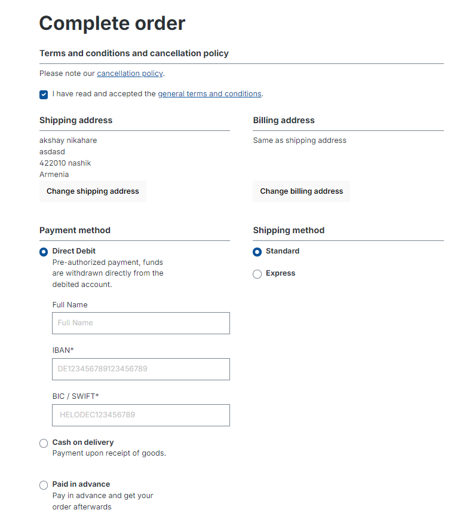
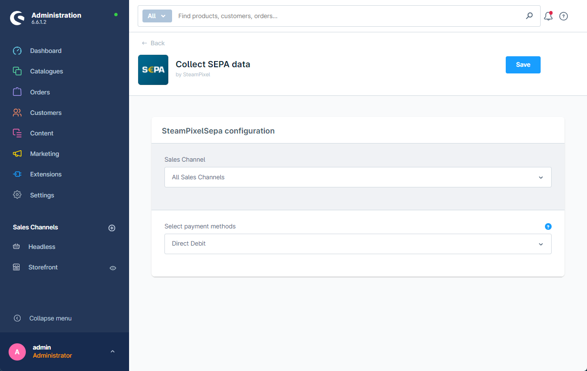

# SEPA Plugin for Shopware 6
This plugin provides a simple way to collect SEPA payment information. It will inject SEPA form fields into the chekout process and into the customer backend section. It will store the SEPA information to each order and will also store the information directly to the customer account. The user can change the information inside the user section. This plugin comes with the AGPLv3 license.

## Requirements and installation

1. Upload the plugin files to your Webspace and place it inside the custom/plugins/SteamPixelSepa folder
2. Enable the plugin in the shop backend

3. Check that following custom fileds are Create for the order entity:
* custom_order_sepa_owner       Text
* custom_order_sepa_iban        Text
* custom_order_sepa_bic         Text

4. Check that following custom fileds are Create for customer entity:
* custom_customer_sepa_owner    Text
* custom_customer_sepa_iban     Text
* custom_customer_sepa_bic      Text

5. Set your payment ID in plugin Configuration This will enable the custom fields for this payment method in the frontend.

6. Clear your shop caches

## Warning and Disclaimer
SEPA information is extremely sensitive data. It is your responsibility to ensure that the software and hardware used (server, operating system, shop software, etc...) meets the latest applicable security requirements. The SEPA data is stored unencrypted inside your database. You should delete this data regularly. The manufacturer of the plugin is not responsible for damage (e.g. data theft) caused by exploiting security vulnerabilities of the shop, the server, the operating system or inside this plugin.

## contributers 

* [Akshay Nikhare](https://github.com/akshaynikhare)
* [Steampixel](https://github.com/steampixel)
